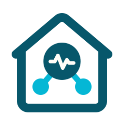
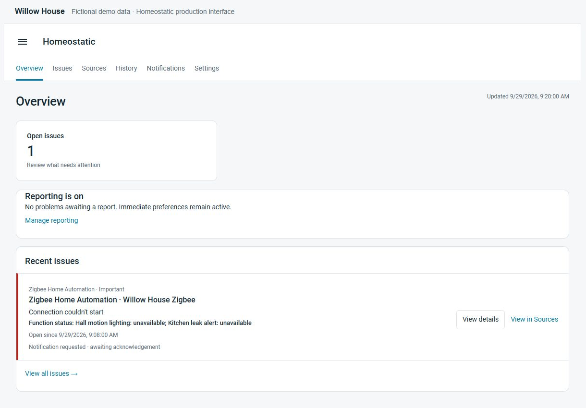
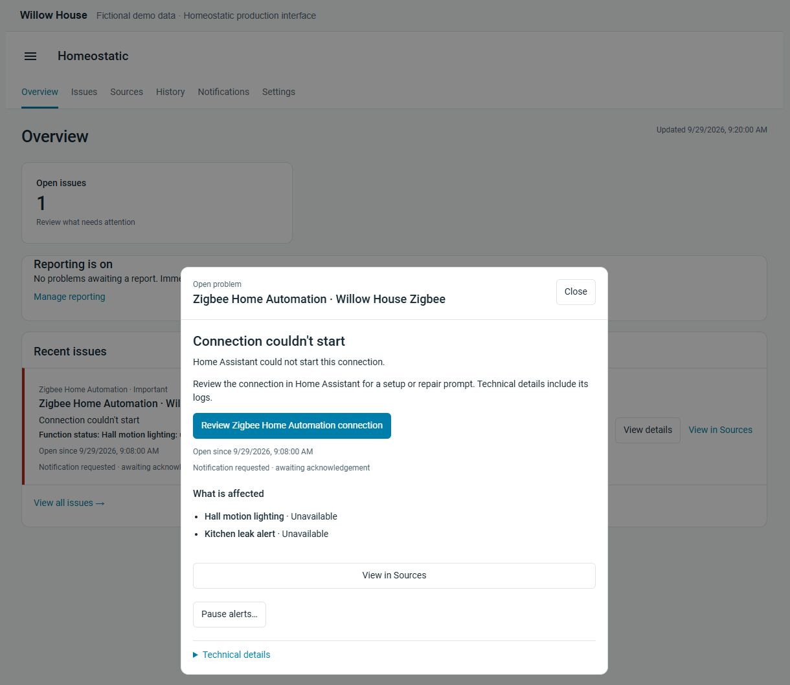
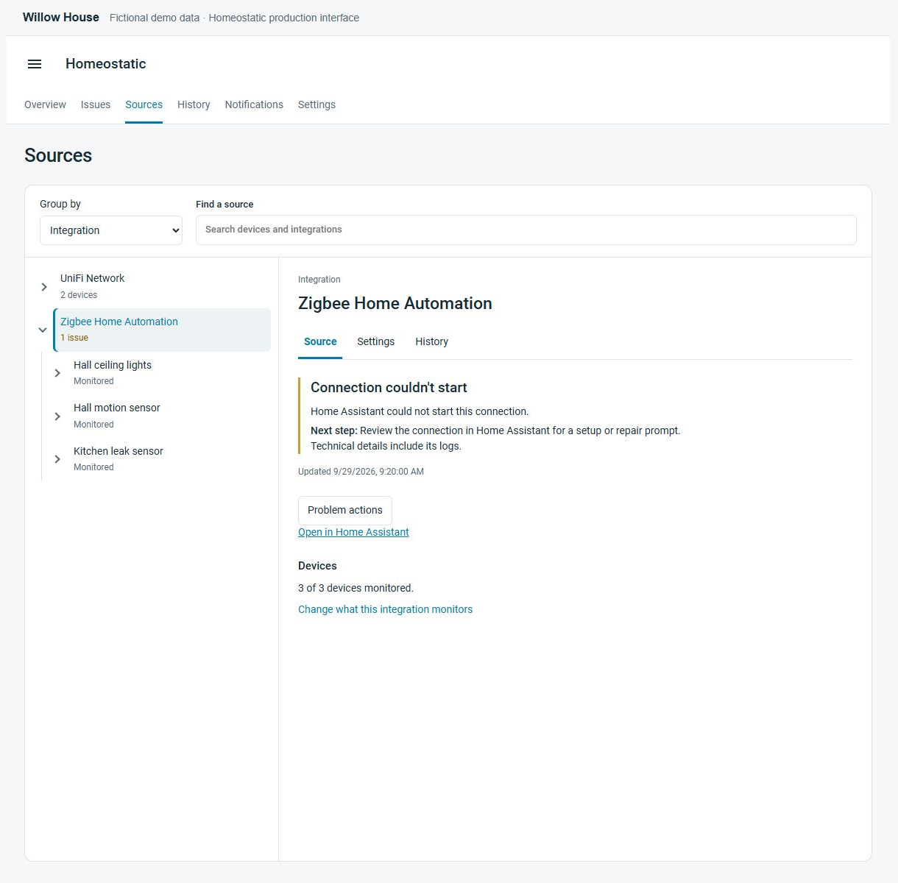
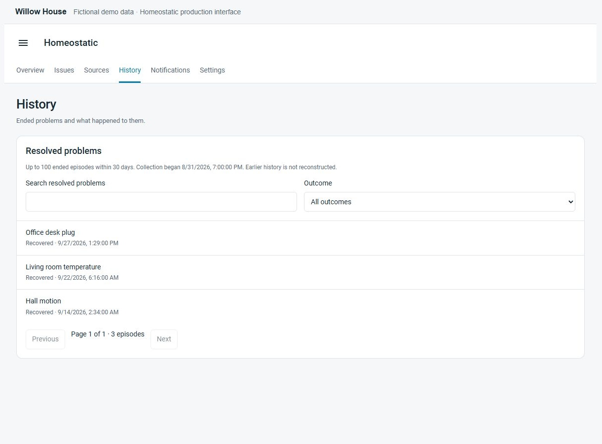
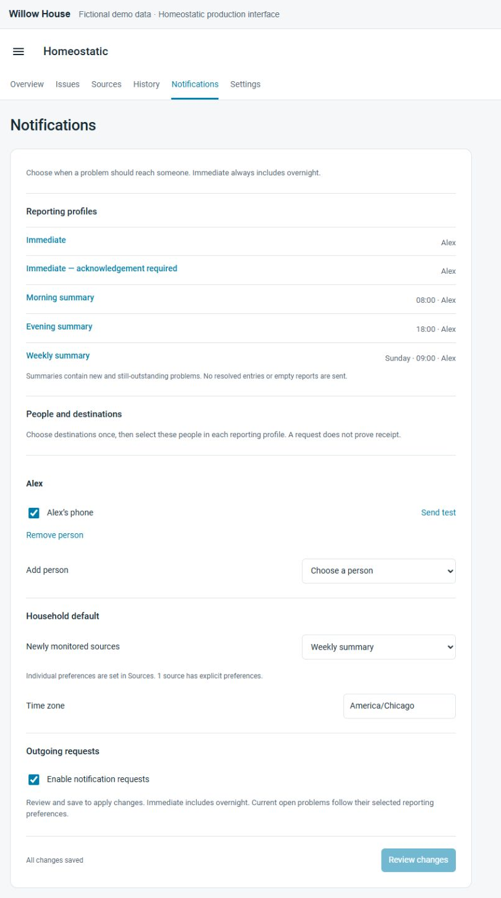

# Homeostatic

<p align="center"><picture><source media="(prefers-color-scheme: dark)" srcset="custom_components/homeostatic/brand/dark_icon.png"></picture></p>

**When the Zigbee coordinator drops at 2 a.m., forty entities go `unavailable`. Homeostatic opens one issue, on the coordinator, says the hall motion lighting is what you just lost, and decides whether that is worth your sleep. One flaky sensor waits for the morning summary.**

[](https://hacs.xyz/docs/faq/custom_repositories/)
[](https://analytics.home-assistant.io/custom_integrations.json)
[](https://github.com/mjcumming/homeostatic/releases)
[](https://github.com/mjcumming/homeostatic/actions/workflows/ci.yml)
[](CONTRIBUTING.md)
[](https://www.home-assistant.io/)
[](https://www.python.org/downloads/)
[](https://pypi.org/project/health-tree/)
[](#project-status)
[](https://github.com/mjcumming/homeostatic)
[](LICENSE)
[](https://github.com/mjcumming/homeostatic/issues)

Homeostatic is a Home Assistant integration that watches the health of your home. It knows which integrations are up, which devices Home Assistant can still reach, whether the things your home *does* are ready, and whether a situation you asked about is happening right now. When something goes wrong it groups the symptoms under their cause, keeps one issue per problem from onset to recovery, and tells the right people at the right time.

> ⭐ **Using Homeostatic?** Please [star the repo](https://github.com/mjcumming/homeostatic). It takes 25 stars to get into the HACS default store, and it helps other Home Assistant users find the project.

<p align="center">
  
</p>

<p align="center"><small>Fictional Willow House demo using the Homeostatic interface. No personal household data is shown.</small></p>

## The problem

A growing Home Assistant install fails in quiet, confusing ways. The lights stop following motion: is it the light, the motion sensor, or the Zigbee integration behind both? A cloud integration needs you to sign in again, and you find out when the music will not play with guests over. A dozen entities go unavailable at once and you get a dozen alerts for one problem, or none, because you gave up on availability notifications a long time ago.

Home Assistant has the inventory: integrations, devices, entities, areas, automations. What it does not have is a health layer that can tell a root failure from its symptoms, say what the failure takes down, and decide who hears about it and when. That is what Homeostatic adds.

## What you get

**A Homeostatic panel in the sidebar.** *Overview* shows what is open and what is watched, with the most recent issues. *Issues* lists every open problem. *Sources* is your whole install, grouped by integration or by floor and area, showing what is watched, what is excluded, what evidence Home Assistant is supplying, and letting you change any of it in place with a preview before you save. *History* keeps ended problems for thirty days. *Notifications* is where people, phones, and schedules live. Any of these pages is also a card you can drop on your own dashboard.

**Issues that explain themselves.** An issue names the integration and the instance, quotes what Home Assistant reported (setup failed, needs sign-in, retrying), lists the affected entities, names the functions it takes down, suggests the next step, and shows recovery as it happens. When it is over, it resolves once and moves to History.

**Functions, and whether they are ready.** Name the things your home does, such as *Garage access* or *Motion lighting*, say what each one needs, and mark how much it matters. Each becomes a sensor reading `ready`, `degraded`, `blocked`, or `unknown` that you can use in automations. Homeostatic can suggest a function's requirements from the automations you already have.

**Alerts you write in the normal automation editor.** Water on the basement floor, the garage open after dark, the freezer above temperature: define the condition with Home Assistant's own triggers and conditions, pick a reporting preference, and Homeostatic gives it an issue, a history, and an Acknowledge button on the phone. A situation like this stays independent of equipment health: a Z-Wave outage makes it `unknown`, not resolved.

**Notifications to people, not to `notify.` services.** Pick the people in your household and the phones they carry. Each source gets one of six reporting preferences: *Immediate*, *Immediate with acknowledgement* (reminds every thirty minutes until someone taps Acknowledge), *Morning*, *Evening*, *Weekly*, or *Dashboard only*. Tapping a notification opens the issue. Notifications are off until you turn them on, and Homeostatic holds everything while Home Assistant restarts so you get one summary instead of a burst.

**Controls for real life.** *Acknowledge* records that someone has seen a problem. *Pause alerts* shelves one problem for up to a week. *Working on this equipment* declares a maintenance window and previews what it affects before you start.

**Events for your own automations.** Every opened, updated, and resolved problem, and every operator action, is a Home Assistant event whether notifications are on or not. Two example blueprints turn them into a status light and a logbook.

## See it in action

In this fictional home, Home Assistant reports that the Zigbee connection could not start. Homeostatic groups the unavailable hall and kitchen entities under that connection and shows that hall motion lighting and the kitchen leak alert are unavailable. The earlier, unrelated availability episodes in History cleared after Home Assistant reported those entities available again. These images come from the [repeatable demo fixture](docs/testing/readme-demo.md), rendered with Homeostatic's production frontend.

<details>
<summary>Open issue, Sources, History, and Notifications screenshots</summary>

### One issue and its impact



### Sources and current evidence



### Resolved history



### Reporting choices



</details>

## How it works

Homeostatic builds a dependency graph from watched entities and their providing integrations, plus the requirements of the functions you define. Device-level selected-entity checks remain separate; a shared inventory parent alone does not establish a dependency. It feeds Home Assistant's own signals into that graph, chiefly integration setup state and entity availability, plus the reports your alert automations send. Three things then happen that Home Assistant cannot do on its own.

*One cause, one issue.* When a watched integration fails and watched entities that depend on it go unavailable with it, one issue opens on the integration and those entity failures are recorded on it as symptoms. Grouping follows the declared dependencies and timing rules; it does not infer a physical cause from simultaneous device failures alone.

*Importance flows up.* A hub is just a box. But *Garage access* depends on it and *Garage access* is `high`, so the hub's issue is `high`. You rate the things you care about, and the equipment inherits it.

*Attention is policy, not status.* A reporting preference decides who hears about a problem and when. Nothing about a problem's health changes because someone was or was not told, and nothing gets quieter because of where it sits in a tree, only because a known cause explains it.

The reasoning lives in [Health Tree](https://github.com/mjcumming/health-tree), a separate Python library with no Home Assistant code and no dependencies, specified by eleven stories drawn from failures in one real house and run as its test suite. Homeostatic is everything Home Assistant-specific: discovery, the monitoring catalog, storage, the dashboard, and delivery.

One honest limit. A passing availability check means Home Assistant currently has a control path to the entity. It does not prove the sensor is sending fresh readings or that a command did what it was told; those need evidence Home Assistant does not yet supply. Homeostatic keeps that distinction visible, so silence never passes for health. The [user guide](docs/guide.md#what-an-availability-problem-means) spells out exactly which entity states produce a warning.

## Requirements

- Home Assistant **2026.9.3** or newer (tested on 2026.9.3, Python 3.14).
- Internet access to PyPI on first setup, so Home Assistant can install the pinned [health-tree](https://pypi.org/project/health-tree/) library.
- An administrator account for the dashboard.

## Installation

### HACS (recommended)

1. In HACS, open the menu (⋮) and choose **Custom repositories**.
2. Add `https://github.com/mjcumming/homeostatic` with type **Integration**.
3. Find **Homeostatic** and select version **1.0.0**. If you previously selected **main** or enabled beta versions, choose the 1.0.0 release explicitly.
4. Restart Home Assistant.

[](https://my.home-assistant.io/redirect/hacs_repository/?owner=mjcumming&repository=homeostatic&category=integration)

### Manual

1. Download `homeostatic-1.0.0.zip` and its checksum file from the [1.0.0 GitHub release](https://github.com/mjcumming/homeostatic/releases/tag/v1.0.0).
2. Copy its `custom_components/homeostatic` folder into your Home Assistant configuration directory, so you end up with `<config>/custom_components/homeostatic/manifest.json`. Replace any older copy in full.
3. Restart Home Assistant.

The [installation guide](docs/pilot.md) covers backups, verifying the archive, and rollback.

## Quick start

1. Go to **Settings > Devices & services > Add integration** and add **Homeostatic**.

   [](https://my.home-assistant.io/redirect/config_flow_start/?domain=homeostatic)

2. Open **Homeostatic** in the sidebar. A new install watches integration health only, so you will see something useful right away without a flood.
3. In **Sources**, pick a few integrations or devices you know well and choose **Edit monitoring**. Preview, then save. On a large install, start small and widen from there.
4. Define one function you care about, in the integration's options under **Functions (YAML list)**:

   ```yaml
   - id: garage_access
     name: Garage access
     importance: high
     requires:
       - cover.garage_door
       - binary_sensor.garage_obstruction
   ```

   It shows up in the panel and as a readiness sensor.

5. Watch it for a day or two with notifications off. Then open **Notifications**, choose people and their phones, review the reporting preferences, and enable requests. The built-in phone sender handles delivery and acknowledgment; no consumer automation is needed.

## Create your own alert

Use Home Assistant's automation editor for the condition and Homeostatic for the issue, its history, its schedule, and acknowledgment.

1. Import the [Homeostatic alert blueprint](https://github.com/mjcumming/homeostatic/blob/main/blueprints/automation/homeostatic/alert.yaml) in **Settings > Automations & scenes > Blueprints**, or copy `alert.yaml` from the release archive to `blueprints/automation/homeostatic/` and reload automations.
2. Choose **Create automation** from the blueprint and fill in:

   | Field | Example |
   | --- | --- |
   | Alert name | Basement water leak |
   | Notification message | Water detected near the basement water heater. |
   | Active when | Basement water sensor is Wet / on |
   | Required evidence | Basement water sensor |
   | Reporting preference | Immediate with acknowledgment |

3. Save and enable it. An active condition opens one issue; repeated reports keep it current; a clear report resolves it. Missing evidence or a stopped automation never counts as recovery. Start with **Dashboard only** while you check a new rule, because both *Immediate* preferences deliver overnight.

Use any of Home Assistant's AND/OR, time, state, and numeric conditions, and list every entity the condition or message needs as required evidence. The [alert guide](docs/automation-situations.md) covers custom automations, the native `report_alert` action, retiring an alert, and converting older situation declarations.

## Dashboard and cards

Administrators get the **Homeostatic** sidebar panel with **Overview**, **Issues**, **Sources**, **History**, **Notifications**, and **Settings**. Any view is also a card:

```yaml
type: custom:homeostatic-card
view: overview   # or sources, history, notifications, configuration, functions, problems
```

A **Homeostatic** dashboard strategy is available in Home Assistant's new-dashboard dialog.

## Blueprints

| Blueprint | What it does |
| --- | --- |
| [Homeostatic alert](blueprints/automation/homeostatic/alert.yaml) | Defines an alert from Home Assistant conditions; the recommended way to create one |
| [Function status light](blueprints/automation/homeostatic/function_status_light.yaml) | Shows a function's readiness on a light |
| [Problem logbook](blueprints/automation/homeostatic/problem_logbook.yaml) | Writes problem changes to the logbook |
| [Companion notifications](blueprints/automation/homeostatic/companion_notification.yaml) | Delivers notification requests through your own automation, if you would rather not use the built-in sender |
| [Report a situation](blueprints/automation/homeostatic/report_situation.yaml) | Reports active, clear, or unknown for a situation declared in the integration's options; the earlier alert workflow |
| [Diagnostic state](blueprints/template/homeostatic/diagnostic_state.yaml) | Maps a device's diagnostic entity to a problem binary sensor |

## Documentation

| Guide | For |
| --- | --- |
| [User guide](docs/guide.md) | Monitoring rules, functions, alerts, reporting preferences, actions, and operator controls |
| [Alert guide](docs/automation-situations.md) | Creating alerts from automations, evidence and timing, retirement, phone acknowledgment |
| [Installation guide](docs/pilot.md) | First install, first observation, controlled checks, rollback |
| [Event contract](docs/events.md) | Building your own automations on Homeostatic events |
| [Specification](docs/spec.md) | Exact implemented behavior and timings |
| [Decisions](docs/adr/README.md) | Architecture decision records: why each choice was made |
| [Roadmap](docs/roadmap.md) | What's planned |
| [Changelog](CHANGELOG.md) | What changed |

## Project status

**Version 1.0.0** is available as a GitHub release and has been exercised in a real-house pilot with 129 integration instances. The dashboard, availability monitoring, functions, alerts, reporting preferences, phone delivery with acknowledgment, and operator controls are included. The release scope is Home Assistant evidence and selected monitoring; the limits below still apply.

How it is built: behavior is written down in a [specification](docs/spec.md) before it changes, every behavior change ships with an executable scenario, and the integration tests run against an isolated Home Assistant instance with 95 percent statement and branch coverage floors. Every product decision that would be easy to reverse by mistake is an [architecture decision record](docs/adr/README.md), thirty-some so far. Notifications are never sent through a live install during tests.

Known limits:

- Homeostatic sees what Home Assistant reports. Freshness, detector liveness, and command-completion checks need evidence producers that do not exist yet; see the [roadmap](docs/roadmap.md).
- Whole-house monitoring of every entity on very large installs (6,000+ entities) does not yet meet responsiveness targets. Start with integrations and selected devices. See [runtime scaling](docs/testing/runtime-scaling.md).
- Homeostatic cannot report the death of the Home Assistant it runs in. A watchdog outside Home Assistant is on the roadmap and, until then, on you.

Bug reports and pilot observations are welcome in [Issues](https://github.com/mjcumming/homeostatic/issues).

## Contributing

See [CONTRIBUTING.md](CONTRIBUTING.md) and the [development setup](docs/development.md). In short:

```bash
uv sync --locked
uv run prek install
uv run python script/check.py --quick
```

## License

[MIT](LICENSE). Report security issues as described in [SECURITY.md](SECURITY.md).
